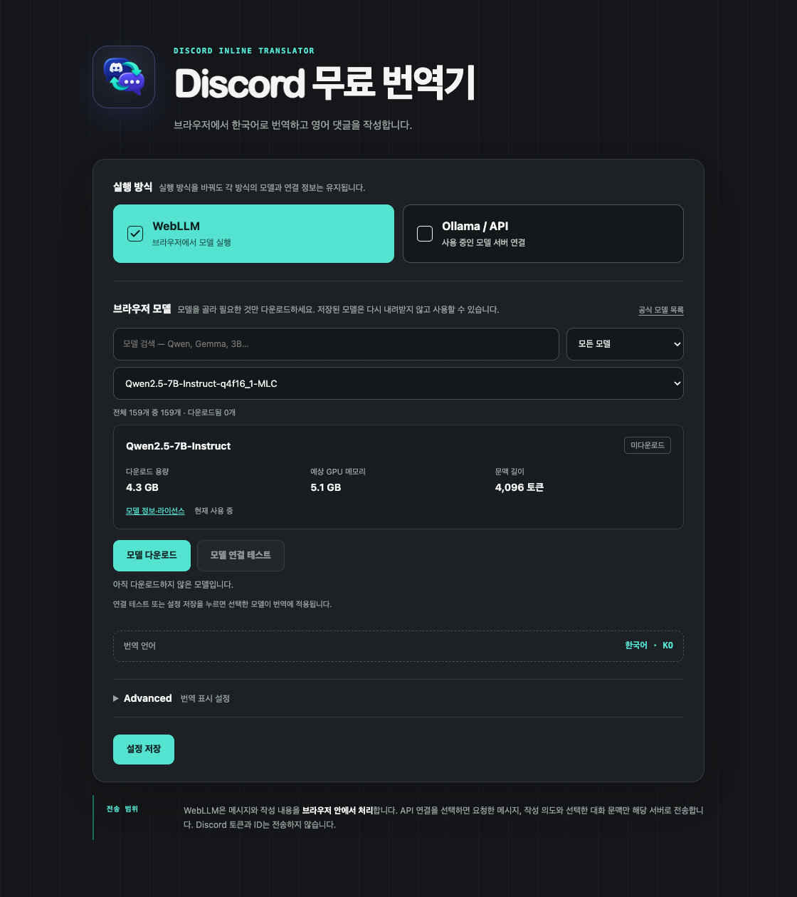
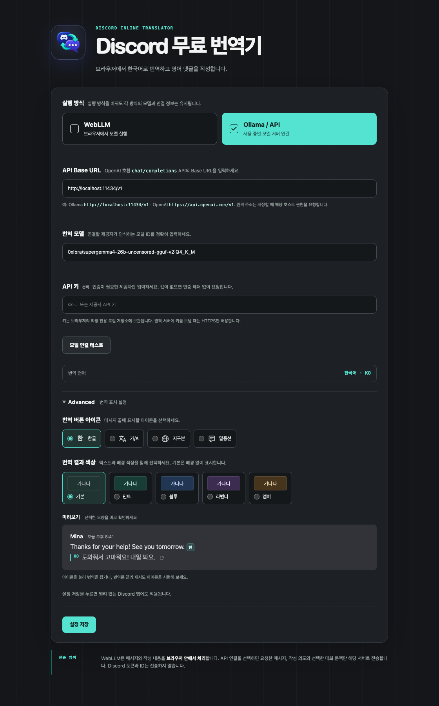

# Discord 무료 번역기


Discord 웹에서 영어 메시지를 한국어로 읽고, 한국어로 쓴 의도를 영어로 작성할 수 있게 돕는 브라우저 확장입니다.

이 문서는 **v0.5.1** 기준입니다. 브라우저의 확장 관리 화면에는 **Discord 한줄 번역**으로 표시됩니다.

메시지 끝의 `[한]` 버튼은 원문 바로 아래에 한국어 번역을 표시합니다. 입력창 옆의 `[영어]` 버튼은 작성 의도에 맞는 영어 문장 3개와 각각의 한국어 의미를 보여줍니다. 직접 답장할 때는 대상 원글을, 이미 열린 스레드에 글을 남길 때는 선택한 대화를 참고합니다. 원하는 영어 문장을 입력창에 넣은 뒤 직접 검토하고 전송합니다.

기본 실행 방식은 **WebLLM + Qwen2.5-7B-Instruct**입니다. API 키나 Ollama 설치 없이 사용자의 GPU에서 번역과 영어 작성을 처리합니다. 설정에서 확장에 포함된 WebLLM 공식 모델 목록 중 임베딩 전용을 제외한 **159개 모델**을 검색하고 원하는 모델만 다운로드할 수 있습니다. 기본 모델은 약 4.3GB이며, 모델별 다운로드 용량·예상 GPU 메모리·저장 상태를 확인한 뒤 선택합니다. 받은 모델은 브라우저에 보관하여 재사용합니다. Chrome 내장 `Translator` API에는 의존하지 않습니다.

WebLLM 방식에는 외부 API 호출 요금이나 확장 자체의 일일 사용 횟수 제한이 없습니다. 모델 다운로드에는 네트워크와 저장 공간이, 실행에는 GPU 자원이 필요합니다. 사용자가 별도로 연결한 원격 API의 요금과 한도는 해당 제공자의 정책을 따릅니다.

설정에서 **Ollama / OpenAI 호환 API**를 선택하면 기존처럼 로컬 Ollama, LM Studio, 자체 호스팅 서버와 원격 LLM 제공자를 연결할 수 있습니다. 이전 버전에서 저장한 API 연결은 유지하며, 실행 방식을 WebLLM으로 바꿔도 서버 주소·모델·API 키는 보관합니다. WebLLM 실패 시 API 서버로 자동 전송하지 않습니다.

## 주요 기능

- 메시지별 `[한]` 버튼으로 필요한 글만 번역
- 클릭 즉시 `KO · 번역 중…` 표시 후 같은 위치에 결과 출력
- 원문을 유지한 채 번역 결과 표시 및 숨김
- 번역문 끝의 재시도 아이콘으로 새 번역 요청
- Advanced 설정에서 번역 버튼 아이콘과 텍스트·배경 색상 조합 선택 및 실시간 미리보기
- 일반 메시지와 답장 메시지의 실제 본문 인식
- 새 메시지, 채널 전환, 무한 스크롤 및 메시지 수정 감지
- URL과 코드 조각을 번역 대상에서 보호
- 페이지 세션 동안 최대 250개 결과 캐시
- 선택적 API 키를 지원하는 OpenAI 호환 LLM 연결
- 임베딩 전용을 제외한 WebLLM 모델 159개 검색·종류별 필터·선택 다운로드
- 모델 목록만 확장에 포함하고, 선택한 모델의 가중치와 WASM 실행 파일만 다운로드
- 모델별 다운로드·부분 저장·GPU 준비 상태, 용량과 예상 GPU 메모리 표시
- 모델 설정 영역에서 다운로드·연결 테스트, 저장한 모델 간 전환과 상태 자동 갱신
- 요청 ID가 포함된 진단 로그 제공
- 입력창 옆 `[영어]` 버튼으로 자연스러운 표현·친근한 표현·정중한 표현 3개 추천
- 일반 채널과 스레드 안의 직접 답장에 대상 원글 자동 연결 및 미리보기
- 이미 진입한 스레드의 일반 작성에서 참고할 대화 여러 개 선택
- 신규 글은 한국어로 작성한 의도만으로 추천
- 영어·한국어 후보 비교, 복사, 커서 위치에 영어 삽입

확장이 브라우저에서 활성화되어 있으면 지원하는 Discord 메시지에 `[한]`, 글 작성 입력창에 `[영어]` 버튼을 표시합니다. 확장 기능을 중지하려면 브라우저의 확장 관리 화면에서 비활성화합니다.


## 지원 환경

| 브라우저 | 빌드 | 비고 |
| --- | --- | --- |
| Brave, Chrome, Edge | `dist/chromium` | Manifest V3. WebLLM은 Chromium 124 이상과 사용 가능한 WebGPU 필요. 기본 모델을 비롯한 f16 모델은 `shader-f16` 필요 |
| Firefox 121 이상 | `dist/firefox` | 기존 API 연결 지원. WebLLM 실행 가능 여부는 브라우저·OS의 WebGPU 지원에 따라 달라짐 |

WebLLM은 그래픽 가속과 충분한 GPU 메모리가 필요합니다. 기본 모델의 WebLLM 메모리 추정치는 약 5.1GB이며 브라우저·운영체제 메모리는 추가로 필요합니다. 다른 모델의 추정치는 설정에서 확인할 수 있습니다. 목록에 있는 모든 모델이 모든 GPU에서 실행되거나 한국어 번역에 적합하다는 뜻은 아닙니다. WebGPU를 사용할 수 없으면 설정에서 API 연결을 선택할 수 있습니다. 실제 GPU 통합 검증은 Brave/Chromium에서 수행합니다.

Discord 웹(`https://discord.com`)에서만 동작합니다. Discord 데스크톱 앱과 이미지·스티커·첨부파일 OCR은 지원하지 않습니다. 영어 작성은 후보 선택 후 입력창에서 직접 검토·수정하고 전송하는 방식입니다.

## 기본 설정

| 항목 | 기본값 |
| --- | --- |
| 실행 방식 | WebLLM |
| 브라우저 모델 | `Qwen2.5-7B-Instruct-q4f16_1-MLC` (4비트 양자화, 설정에서 변경 가능) |
| API 연결 기본 주소 | `http://localhost:11434/v1` |
| API 연결 기본 모델 | `0xIbra/supergemma4-26b-uncensored-gguf-v2:Q4_K_M` |
| API 키 | 없음 |
| 읽기 번역 | 한국어(`KO`) |
| 영어 작성 추천 | 영어 문장 3개와 각각의 한국어 의미 |
| 동시 요청 | 1개 |
| 요청 제한 시간 | 3분 |
| WebLLM 최초 모델 준비 제한 시간 | 10분 |
| WebLLM 문맥 범위 | 기본 모델은 입력·출력 합계 4,096토큰, 다른 모델은 설정에 표시된 범위 적용 |
| 읽기 번역 원문 길이 제한 | 10,000자 |
| 작성 의도 길이 제한 | 4,000자 |
| 작성 문맥 제한 | 최대 12개 메시지·합계 16,000자 |

WebLLM에서는 메시지·작성 의도·선택한 대화가 기기 밖으로 전송되지 않습니다. 확장에는 공통 JavaScript와 모델 목록·다운로드 주소·검증 해시만 포함합니다. 사용자가 모델을 다운로드할 때 해당 모델의 가중치·토크나이저는 Hugging Face에서, WASM 실행 파일은 고정된 MLC GitHub 주소에서 받아 저장합니다. 모델 캐시가 있으면 백그라운드가 다시 시작되어도 다음 요청에서 자동으로 불러옵니다.

모델은 확장 API 권한과 외부 통신 권한이 없는 격리 페이지에서 실행합니다. 숨겨진 확장 문서가 선택한 모델의 파일만 다운로드·검증·저장하고, 격리 페이지에 전달합니다. API 주소·키는 격리 페이지로 보내지 않습니다. 이 구조는 [Manifest V3의 격리된 실행 환경에 대한 예외](https://developer.chrome.com/docs/webstore/program-policies/mv3-requirements)를 사용합니다.

문자 수 제한 이내여도 WebLLM의 토큰 범위나 출력 길이를 넘으면 오류를 표시합니다. 선택한 문맥을 임의로 자르거나 잘린 응답을 성공으로 표시하지 않습니다. 길이를 줄이거나 더 큰 문맥을 지원하는 API 모델로 전환하세요. 한국어 번역과 영어·한국어 추천 품질은 선택한 모델의 능력에 따라 달라지므로 결과를 검토한 뒤 사용하세요.

WebLLM과 API 읽기 번역은 한국어 지시문으로 번역문만 일반 텍스트로 요청합니다. 원문을 반복하거나 질문에 답하지 말고, 원문의 내용을 한국어로 옮기도록 지시합니다. 읽기 번역에는 JSON 출력 형식을 강제하지 않으며, 영어 작성 후보 3개에는 기존 JSON 형식을 사용합니다.

확장은 읽기 번역의 언어·원문 반복·부연 설명·표식 변경 여부로 결과를 차단하거나 일부를 삭제하지 않습니다. 응답 포장(JSON·코드 블록 등)을 풀고 URL·코드 표식을 복원한 뒤 모델이 반환한 내용을 표시합니다. 결과를 보고 다시 번역하고 싶으면 번역 옆의 `다시 시도` 버튼을 누르세요. 캐시를 건너뛰고 새 번역을 요청합니다. 빈 응답에는 `번역하지 못했습니다.`와 `다시 시도` 버튼을 표시합니다.

## 빠른 시작: Brave + WebLLM

### 1. 확장 빌드

Node.js 20 이상을 사용합니다. WebLLM과 빌드·검증 패키지를 설치합니다.

```sh
npm ci
npm run check
```

이 명령은 JavaScript 문법 검사, 자동 테스트, Chromium 및 Firefox 빌드를 차례로 수행합니다.

**빌드는 모델 가중치나 모델별 WASM을 다운로드하지 않습니다.** 배포본은 압축 전 약 **7MB**이며, 공통 JavaScript와 전체 모델의 메타데이터를 포함합니다. 설정에서 고른 모델의 파일만 필요할 때 다운로드하고, WASM은 SHA-256을 검증한 뒤 저장합니다. 전체 모델과 실행 파일의 고정 버전·해시는 `webllm/catalog.json`, 기본 모델의 기존 호환 정보는 `webllm/model.json`, 라이선스와 고지는 `webllm/NOTICE.md`와 `webllm/licenses/`에서 확인할 수 있습니다.

모든 빌드 명령은 저장소 루트에도 `webllm-provider.js`, `webllm/host.js`, `webllm/sandbox.js`를 생성하며, 이전 빌드가 동봉했던 `webllm/*.wasm`은 정리합니다. 이전에 루트 폴더를 확장으로 등록했다면 빌드 후 기존 확장을 새로고침하여 같은 확장 ID와 저장된 설정을 계속 사용할 수 있습니다. 이 생성 파일은 Git에 포함하지 않으므로 새로 복제한 저장소에서는 먼저 빌드해야 합니다.

### 2. Brave에 설치

1. `brave://extensions`를 엽니다.
2. `개발자 모드`를 켭니다.
3. `압축해제된 확장 프로그램을 로드합니다`를 누릅니다.
4. 이 저장소의 `dist/chromium` 디렉터리를 선택합니다.
5. 확장 아이콘을 눌러 설정 화면을 엽니다.
6. 실행 방식에서 `WebLLM` 버튼을 선택합니다.
7. 브라우저 모델을 검색하거나 목록에서 고릅니다. 용량·GPU 메모리와 `모델 정보·라이선스` 링크를 확인합니다.
8. 모델 바로 아래의 `모델 다운로드`를 누르고 다운로드·GPU 준비가 끝날 때까지 기다립니다. 이미 받은 모델은 다시 다운로드할 필요가 없습니다.
9. `모델 연결 테스트`로 선택한 모델을 적용하고 시험 번역을 확인하거나, `설정 저장`으로 선택을 적용합니다.
10. 이미 열려 있던 Discord 탭을 새로고침합니다.

모델 다운로드를 시작한 뒤 설정 탭을 닫아도 작업은 백그라운드에서 계속됩니다. 다시 설정을 열면 진행 상태를 확인할 수 있습니다. 브라우저 종료나 확장 재로드로 중단되면 해당 모델의 다운로드를 다시 실행하세요. 완료된 파일은 캐시에서 재사용합니다. 준비 전에 Discord에서 번역을 요청하면 설정을 여는 안내가 표시됩니다.

기존 Qwen2.5 기본 모델의 다운로드 주소와 가중치 캐시는 유지합니다. 기존 동봉 방식으로 사용하던 모델은 `모델 다운로드`를 한 번 눌러 필요한 WASM만 추가로 받으면 됩니다. 저장된 가중치를 다시 받지 않습니다. 이전에 저장한 Ollama / API 연결 정보도 그대로 유지하며, 각 실행 방식의 모델 선택은 별도로 저장합니다. 다운로드 상태는 목록에 고정된 모델 버전의 파일을 기준으로 확인합니다. 과거의 다른 버전 파일은 저장소에 남아 있어도 현재 모델의 다운로드 완료로 표시하지 않습니다.

코드를 변경한 뒤에는 `npm run build:chromium`을 실행하고 `brave://extensions`에서 확장을 다시 로드한 다음, 이미 열려 있는 Discord 탭도 새로고침해야 합니다.

### WebLLM 모델 저장 위치와 삭제

다운로드한 가중치·토크나이저·WASM은 **이 확장 프로그램 출처의 Cache Storage**에 저장됩니다. 캐시 이름은 `webllm/model`, `webllm/config`, `webllm/wasm`입니다. 모델마다 URL이 달라서 기본 모델을 변경해도 이전 모델 파일은 자동으로 삭제되지 않습니다. 여러 모델이 같은 WASM을 사용하는 경우 실행 파일은 공유합니다. 확장 새로고침이나 브라우저 재시작 후에도 캐시는 재사용됩니다. `다운로드된 모델` 필터로 보관 중인 모델을 확인할 수 있습니다. 이 프로젝트는 [WebLLM의 Cache API 방식](https://webllm.mlc.ai/docs/user/advanced_usage.html#using-indexeddb-cache)을 사용합니다.

macOS의 Brave 기본 프로필에서는 다음 경로 아래에 저장됩니다. 실제 확장별 디렉터리 이름은 브라우저가 생성한 해시이며, 프로필이 다르면 경로도 달라집니다.

```text
~/Library/Application Support/BraveSoftware/Brave-Browser/Default/Service Worker/CacheStorage/
```

이 확장에서 다운로드한 WebLLM 모델을 모두 지우려면 다운로드와 번역이 끝난 상태에서 다음 순서로 진행합니다.

1. `brave://extensions`에서 개발자 모드를 켭니다.
2. **Discord 한줄 번역** 항목의 `서비스 워커` 링크를 눌러 해당 확장의 개발자 도구를 엽니다.
3. `Console`에서 아래 코드를 실행합니다. `webllm/`으로 시작하는 이 확장의 캐시만 지웁니다.

```js
const modelCaches = (await caches.keys()).filter(name => name.startsWith("webllm/"));
await Promise.all(modelCaches.map(name => caches.delete(name)));
chrome.runtime.reload();
```

삭제 후 Discord 탭을 새로고침하고, WebLLM을 다시 사용하려면 설정에서 사용할 모델을 골라 `모델 다운로드`를 실행합니다. 저장한 API 주소·키·UI 설정은 `chrome.storage.local`에 있으므로 위 코드의 삭제 대상에 포함되지 않습니다. `CacheStorage` 상위 폴더 전체를 파일 탐색기에서 삭제하면 다른 사이트나 확장의 캐시까지 영향을 받으므로, 해당 확장의 개발자 도구에서 처리하세요. [Chrome Cache Storage 안내](https://developer.chrome.com/docs/devtools/storage/cache)에서 저장 내용을 확인하는 방법도 볼 수 있습니다.

### Ollama / OpenAI 호환 API 사용

설정의 실행 방식을 `Ollama / API`로 선택하고 Base URL, 모델 ID와 선택적 API 키를 입력한 뒤 바로 아래의 `모델 연결 테스트`를 실행합니다. 테스트는 입력한 설정을 저장한 뒤 요청합니다. 기존 `http://localhost:11434` Ollama 설정은 `/v1` 주소로 자동 변환됩니다.

```sh
ollama list
ollama pull 0xIbra/supergemma4-26b-uncensored-gguf-v2:Q4_K_M
```

Ollama가 확장 요청을 차단하면 실행 중인 Ollama를 종료한 다음 확장 Origin을 허용하여 다시 실행합니다.

```sh
OLLAMA_ORIGINS='chrome-extension://*,moz-extension://*' ollama serve
```

## 설정 화면

상단의 `WebLLM` / `Ollama / API` 버튼으로 실행 방식을 선택합니다. 실행 방식·브라우저 모델·API Base URL·번역 모델·API 키·Advanced 내부 항목은 제목 옆에 설명을 배치하며, 좁은 화면에서는 자연스럽게 줄바꿈합니다. 다운로드와 연결 테스트는 해당 모델 설정 영역에서 실행합니다.



<details>
<summary>Ollama / API 연결과 Advanced 설정 화면 보기</summary>



</details>

| 설정 | 설명 |
| --- | --- |
| 실행 방식 | 체크 아이콘과 반전된 색상으로 선택을 표시하는 WebLLM / Ollama·API 버튼입니다. 방향키로도 선택할 수 있습니다. |
| 브라우저 모델 | 임베딩 전용을 제외한 공식 모델 159개를 검색하고 `모든 모델`·`다운로드된 모델`·`문장 생성`·`이미지·문장 생성`으로 필터링합니다. 모델별 용량·예상 GPU 메모리·문맥 길이·저장 상태를 표시합니다. |
| 모델 다운로드 | 선택한 모델만 다운로드합니다. 현재 번역에 적용한 모델 설정은 바꾸지 않습니다. |
| 모델 연결 테스트 | 해당 모델 설정을 저장·적용한 뒤 실제 시험 번역을 요청합니다. WebLLM에서는 다운로드한 모델을 사용합니다. |
| API Base URL | OpenAI 호환 API의 기준 주소입니다. 예: `http://localhost:11434/v1`, `https://api.openai.com/v1` |
| 번역 모델 | 연결한 제공자가 인식하는 정확한 모델 ID입니다. 읽기 번역과 영어 작성 추천에 함께 사용합니다. |
| API 키 | 인증이 필요한 제공자에서만 입력합니다. 비어 있으면 인증 헤더를 보내지 않습니다. |
| 번역 언어 | 현재 한국어(`KO`)로 고정되어 있습니다. |
| Advanced → 번역 버튼 아이콘 | 한글, 가/A, 지구본, 말풍선 중에서 선택합니다. |
| Advanced → 번역 결과 색상 | 기본(배경 없음), 민트, 블루, 라벤더, 앰버 중 텍스트·배경 조합을 선택합니다. |

모델 저장 상태는 설정을 열거나 모델을 선택할 때 자동으로 확인하고, 다운로드·준비 중에는 계속 갱신합니다. `미다운로드`, `일부 다운로드됨`, `다운로드됨`, `다운로드·준비 중`, `사용 준비 완료`로 상태를 구분합니다. 일부 파일만 저장되어 있으면 `다운로드 이어받기`로 나머지를 받고, 완료되면 다운로드 버튼이 `다운로드 완료`로 바뀝니다. 목록 검색·필터·상태 확인만으로 모델을 다운로드하거나 GPU에 올리지는 않습니다.

`Advanced`는 기본적으로 접혀 있습니다. 펼친 뒤 아이콘과 색상을 선택하면 예시 메시지에 즉시 반영됩니다. `설정 저장`을 누르면 선택한 모양이 저장되고, 열려 있는 Discord 탭의 기존 메시지와 이후 메시지에도 적용됩니다.

`설정 저장`은 실행 방식·선택한 모델·표시 설정을 저장합니다. 각 방식의 모델과 저장한 API 주소·키는 별도로 유지합니다. API 모드에서는 입력값을 검증하고 선택한 API 호스트의 접근 권한도 요청합니다. WebLLM 모드에서는 API 호스트 권한을 요청하지 않습니다.

`모델 연결 테스트`는 현재 설정을 저장한 뒤 `Hello, nice to meet you.` 문장의 시험 번역을 실제로 요청합니다. 성공은 엔진에서 표시할 텍스트를 받았다는 뜻입니다. 화면의 시험 번역으로 언어와 품질을 직접 확인할 수 있습니다. WebLLM 테스트는 모델을 자동 다운로드하지 않으며, 저장된 모델을 GPU에 불러와 사용합니다. 다른 모델로 전환하면 이전 모델은 GPU에서 내려가지만 다운로드 파일은 유지됩니다.

목록은 [WebLLM 공식 `config.ts`](https://github.com/mlc-ai/web-llm/blob/5f742443179a5463e83a19f704d7c19f1f019f98/src/config.ts)의 활성 모델 중 임베딩 전용 4개를 제외한 159개를 포함합니다(대화 157개, 이미지 2개). 임베딩 전용 모델과 해당 실행 파일의 메타데이터는 포함하지 않으며, 목록 갱신 시에도 제외합니다. 이미지 모델도 이 확장에서는 텍스트 입력만 사용합니다. 모델별 이용 조건은 `모델 정보·라이선스` 링크에서 확인하세요. 목록과 실행 파일의 주소·해시는 확장에 고정되어 있으며 새 공식 모델을 추가하려면 메타데이터를 갱신하고 다시 빌드합니다.

API 키는 브라우저의 확장 전용 로컬 저장소에 보관됩니다. 별도 암호화는 하지 않으므로 공용 브라우저 프로필에는 저장하지 않는 것이 좋습니다.

## OpenAI 호환 API 요구사항

확장은 다음 요청과 응답 형식을 사용하는 서버를 지원합니다.

- 요청: `POST /chat/completions`
- 본문: `model`, `messages`, `stream: false`
- 응답: `choices[0].message.content`
- 인증: API 키가 있을 때만 `Authorization: Bearer <API_KEY>`

읽기 번역은 `content` 문자열에 한국어 번역문을 반환합니다. 영어 작성 추천은 같은 필드에 `suggestions` 배열을 가진 JSON 문자열을 반환해야 합니다. 배열에는 `tone`이 `natural`, `friendly`, `polite`인 후보가 각각 하나씩 있어야 하며, 각 후보에는 영어 문장 `en`과 그 문장의 한국어 의미 `ko`가 필요합니다. 확장이 이 형식을 프롬프트로 요청하고, 서로 다른 영어 후보 3개가 모두 있는지 검증합니다.

Base URL이 이미 `/chat/completions`로 끝나면 그대로 사용합니다. 그렇지 않으면 해당 경로를 자동으로 추가합니다.

API 키가 있는 원격 엔드포인트는 HTTPS만 허용합니다. `localhost`와 `127.0.0.1`은 API 키 유무와 관계없이 HTTP를 사용할 수 있습니다.

## Discord 메시지를 한국어로 읽기

1. Discord 웹을 열거나 새로고침합니다.
2. 번역할 메시지 끝의 `[한]` 버튼을 누릅니다.
3. 원문 아래에 `KO · 번역 중…`이 즉시 나타납니다.
4. 번역이 끝나면 같은 영역에 한국어 결과가 표시됩니다.
5. 완료된 메시지의 `[한]` 버튼을 다시 누르면 번역 결과를 숨기거나 다시 표시할 수 있습니다.
6. 번역이 어색하면 번역문 끝의 작은 재시도 아이콘을 누릅니다. 기존 캐시를 사용하지 않고 원문을 다시 번역하며, 완료된 결과로 갱신합니다. 요청 중에는 중복 클릭을 막습니다.

`[한]` 버튼의 모양은 설정의 `Advanced`에서 변경할 수 있습니다. 선택한 아이콘에 관계없이 번역 및 숨기기 동작은 같습니다.

번역 요청에는 클릭한 메시지 본문만 포함됩니다. WebLLM에서는 이 내용을 기기 안에서 처리합니다. API 모드에서도 답장 메시지의 인용 미리보기, Discord 토큰, 쿠키, 사용자 ID, 채널 ID와 메시지 ID는 LLM 엔드포인트로 보내지 않습니다.

## 한국어로 의도를 쓰고 영어로 작성하기

1. 작성할 Discord 입력창 옆의 `[영어]` 버튼을 누릅니다.
2. 아래 표에 따라 원글 또는 참고할 대화를 확인합니다.
3. `전달할 내용 / 의도`에 한국어로 작성합니다. 예: `수정해 줘서 고맙고, 확인한 뒤 추가 문제가 있으면 알려주겠다고 해줘.`
4. `추천 3개 만들기`를 누릅니다. `⌘/Ctrl + Enter`로도 요청할 수 있습니다. 일반 Enter는 줄바꿈이며 한글 조합 중에는 요청하지 않습니다.
5. 자연스럽게·친근하게·정중하게 쓴 영어 문장과 각각의 한국어 의미를 비교합니다.
6. `이 문장 넣기`로 선택한 영어 문장을 작성 도우미를 열었을 때의 커서 위치에 추가합니다. 선택 범위가 있었다면 그 끝에 추가하여 기존 텍스트를 유지합니다. 필요하면 `복사`를 사용할 수 있습니다.
7. Discord 입력창에서 검토·수정하고 직접 전송합니다.

| 상황 | 원글·문맥 처리 |
| --- | --- |
| 일반 채널 또는 DM에서 특정 메시지에 직접 답장 | Discord에서 지정한 원글 한 개를 작성창 위에 표시하고 의도와 함께 전달합니다. |
| 스레드 안에서 특정 메시지에 직접 답장 | Direct 답장과 같습니다. 해당 원글 한 개만 사용하고 스레드 선택 문맥은 섞지 않습니다. |
| 이미 열린 스레드 자체에 글 작성 | 작성창의 대화 목록에서 참고할 글을 여러 개 선택합니다. 선택한 글만 시간순으로 전달합니다. |
| 일반 채널 또는 DM에 신규 글 작성 | 원글 영역 없이 작성한 의도만 전달합니다. |

스레드는 이미 진입한 상태에서 작성하며, 옆 패널과 단독 화면에서 같은 방식으로 사용할 수 있습니다. 참고할 대화를 체크하고 `선택 마침`을 누르면 선택한 글만 확인할 수 있습니다. `대화 선택`으로 다시 고르거나, `문맥 없이 작성`으로 선택을 모두 해제할 수 있습니다. 선택한 대화가 없으면 작성 의도만 전달합니다. 스레드 안에서 직접 답장으로 전환하면 대상 원글 한 개만 사용하며, 직접 답장을 취소하면 이전 문맥 선택으로 돌아옵니다.

스레드 선택 목록에는 현재 불러온 텍스트 메시지가 나타납니다. 이전 대화가 필요하면 스레드를 위로 스크롤해 불러온 뒤 작성창을 열어 선택합니다. 선택한 글은 스크롤로 화면에서 사라져도 선택 당시 본문을 유지합니다. 화면에 있는 선택 메시지가 수정되면 미리보기와 문맥을 갱신합니다. 이미 한국어로 번역한 글은 미리보기에 번역도 함께 표시합니다. 번역 표시만 갱신된 경우에는 기존 영어 추천을 유지합니다.

직접 답장의 원글을 아직 확인할 수 없다면 추천 버튼을 잠시 비활성화합니다. Discord의 답장 표시줄을 눌러 원글을 불러오면 원문을 다시 확인합니다. 작성 도우미가 원글을 찾기 위해 Discord 내부 API에 접근하지는 않습니다.

의도는 최대 4,000자, 참고할 대화는 최대 12개·합계 16,000자입니다. 한도를 넘으면 선택을 줄이도록 안내하며 본문을 임의로 잘라 보내지 않습니다. 추천 3개는 기존에 설정한 LLM으로 한 번에 요청하며, 읽기 번역과 같은 요청 큐와 3분 제한 시간을 사용합니다.

작성 내용·답장 대상·선택 문맥·모델 설정이 바뀌면 이전 추천을 무효화합니다. 요청 중 채널을 옮기거나 창을 닫으면 늦게 도착한 결과를 적용하지 않습니다. 초안과 선택 상태는 현재 탭의 메모리에만 최대 20개 대화 단위로 보관하며, 페이지 새로고침으로 초기화됩니다.

작성창을 열거나 문맥을 선택하는 것만으로는 LLM을 호출하지 않습니다. `추천 3개 만들기` 또는 `다시 추천`을 누를 때 작성 의도와 해당 문맥을 전달합니다.

원래 Discord 입력창 내용이 작성 도중 바뀌면 자동 입력을 중단하고 삽입 위치를 다시 확인하도록 안내합니다. 입력은 Slate 편집기의 일반 텍스트 붙여넣기 처리로 수행되며, 실행 취소의 묶음 단위는 편집기 자체 정책을 따릅니다. 자동 입력을 사용할 수 없는 경우 후보의 `복사` 버튼을 사용합니다.

## 권한과 개인정보

- `discord.com`: 메시지 번역과 영어 작성 버튼을 표시하고, 답장 원글·선택할 대화를 읽어 추천 문장을 입력창에 넣습니다.
- `storage`: 실행 방식, 각 방식의 모델 ID, API Base URL·키와 아이콘·색상 설정을 저장합니다.
- `unlimitedStorage`: 다운로드한 모델을 확장 전용 캐시에 보관합니다.
- `offscreen`(Chromium): 설정 탭을 닫아도 모델 다운로드와 실행을 이어갈 숨겨진 문서를 만듭니다.
- `huggingface.co`, `*.hf.co`: 모델 가중치와 토크나이저 다운로드에 사용합니다. Discord 본문과 API 키는 보내지 않습니다.
- `raw.githubusercontent.com/mlc-ai/binary-mlc-llm-libs/`: 선택한 모델의 WASM 실행 파일을 고정된 주소에서 다운로드하고 SHA-256을 검증합니다.
- `localhost`, `127.0.0.1`: 기본 로컬 LLM 연결에 사용하는 필수 호스트 권한입니다.
- 사용자가 입력한 원격 호스트: 설정 저장 시 해당 호스트만 런타임 권한을 요청합니다.

매니페스트의 선택적 원격 호스트 패턴은 권한을 요청할 수 있는 범위만 선언합니다. 설치와 동시에 모든 웹사이트 접근 권한을 얻지 않습니다. 모델 다운로드 호스트와 기본 로컬 주소 외의 API 호스트는 설정 저장 과정에서 승인받습니다.

확장 개발자가 운영하는 중계 서버, 분석 서버, 광고 또는 추적 기능은 없습니다. 자세한 내용은 [PRIVACY.md](PRIVACY.md)를 참고하세요.

## 문제 해결

### `Service worker registration failed. Status code: 15` / `webllm-provider.js failed to load`

WebLLM 실행 파일이 없는 폴더를 확장으로 로드하면 발생합니다. 저장소에서 `npm ci`와 `npm run build:chromium`을 실행한 뒤 `brave://extensions`에서 기존 확장의 새로고침 버튼을 누릅니다. 빌드는 루트 폴더와 `dist/chromium` 양쪽에 필요한 파일을 준비하므로 기존 확장을 삭제하거나 설치 경로를 변경할 필요가 없습니다. 이미 열린 Discord 탭도 새로고침합니다.

### `[한]` 또는 `[영어]` 버튼이 보이지 않음

- `brave://extensions`에서 확장이 활성화되어 있는지 확인합니다.
- 확장을 다시 로드한 후 Discord 탭도 새로고침합니다.
- Discord가 `https://discord.com`에서 열려 있는지 확인합니다.
- `[영어]` 버튼은 새 글·답장 작성 입력창에 표시합니다. 검색창과 기존 메시지 수정창에는 표시하지 않습니다.
- 답장 메시지 또는 채널 전환 후 발생한다면 Discord 탭의 콘솔에서 `[DiscordTranslator]` 로그를 확인합니다.

### 영어 추천 또는 입력이 되지 않음

| 상황 | 확인할 내용 |
| --- | --- |
| 직접 답장의 추천 버튼이 비활성화됨 | 한국어 의도를 입력하고, 원글이 보이지 않으면 Discord 답장 표시줄을 눌러 원글을 불러온 뒤 작성창을 다시 엽니다. |
| 스레드 목록에 필요한 글이 없음 | 해당 스레드를 위로 스크롤해 이전 대화를 불러온 뒤 `대화 선택`에서 확인합니다. 텍스트 본문이 없는 메시지는 목록에 포함되지 않습니다. |
| `INTENT_TOO_LONG` 또는 `CONTEXT_TOO_LONG` | 의도는 4,000자 이내, 문맥은 12개·합계 16,000자 이내로 줄입니다. |
| `INVALID_SUGGESTIONS` | 영어·한국어 쌍 3개가 올바른 형식으로 반환되지 않았습니다. 다시 추천하고, 반복되면 연결한 모델의 JSON 응답을 확인합니다. |
| `EDITOR_CHANGED` | 원래 입력창이나 답장 대상이 바뀌었습니다. 작성창을 다시 열어 원글과 삽입 위치를 확인합니다. |
| `INSERT_UNAVAILABLE` | Discord 입력창에 문장이 추가됐는지 먼저 확인합니다. 필요한 경우 후보의 `복사` 버튼으로 직접 붙여넣습니다. |

요청 실패 후에도 한국어 초안과 문맥 선택은 유지됩니다. 작성창에 `연결 설정 열기` 또는 `Discord 새로고침` 안내가 나타나면 해당 동작으로 복구할 수 있습니다. 페이지를 새로고침하면 메모리에 보관한 초안은 초기화됩니다.

### 연결 테스트·번역·영어 추천 요청 실패

| 오류 코드 | 확인할 내용 |
| --- | --- |
| `WEBLLM_NOT_READY` | 설정에서 선택한 모델의 `모델 다운로드`를 실행합니다. |
| `WEBGPU_UNAVAILABLE` | 그래픽 가속과 GPU 지원을 확인하거나 Ollama / API 모드를 선택합니다. |
| `WEBLLM_LOAD_FAILED`, `WEBLLM_LOAD_TIMEOUT` | 네트워크·저장 공간·GPU 메모리를 확인한 뒤 모델 다운로드나 연결 테스트를 다시 실행합니다. 준비 제한은 10분입니다. |
| `WEBLLM_MODEL_NOT_FOUND` | 설정에서 현재 목록에 있는 모델을 다시 선택합니다. |
| `WEBLLM_CONTEXT_TOO_LONG`, `WEBLLM_OUTPUT_TOO_LONG` | 원문·작성 의도·선택한 문맥을 줄이거나 API 모델로 전환합니다. |
| `PROVIDER_PERMISSION_MISSING` | 설정 저장 시 표시되는 API 호스트 권한 요청을 승인합니다. |
| `API_UNREACHABLE` | Base URL, 서버 실행 상태, 네트워크와 서버의 Origin/CORS 설정을 확인합니다. |
| `API_AUTH_ERROR` | API 키와 서버의 확장 Origin 허용 설정을 확인합니다. |
| `API_ENDPOINT_NOT_FOUND` | Base URL 및 OpenAI 호환 `/chat/completions` 경로를 확인합니다. |
| `MODEL_NOT_FOUND` | 제공자가 인식하는 정확한 모델 ID인지 확인합니다. |
| `OPTIONS_PAGE_OPEN_FAILED` | 확장 아이콘을 눌러 설정 화면을 직접 열고 확장을 다시 로드합니다. |
| `INSECURE_API_KEY_ENDPOINT` | API 키를 사용하는 원격 서버를 HTTPS로 연결합니다. |
| `INVALID_RESPONSE` | 응답에 `choices[0].message.content` 문자열이 포함되는지 확인합니다. |
| `TIMEOUT` | 모델 로딩 상태와 서버 응답 시간을 확인합니다. 제한 시간은 3분입니다. |
| `RATE_LIMITED` | 제공자의 요청 한도와 계정 사용량을 확인한 뒤 다시 시도합니다. |
| `API_ERROR` | 연결한 제공자의 응답 메시지와 서비스 상태를 확인합니다. |
| `EXTENSION_RELOADED` | 확장 재로드로 기존 탭의 연결이 해제되었습니다. 번역 영역의 `Discord 새로고침`을 누르거나 Discord 탭을 새로고침합니다. |
| `BACKGROUND_DISCONNECTED` | 번역 응답을 기다리던 연결이 끊겼습니다. `다시 시도`로 새 번역을 요청합니다. |
| `EXTENSION_ERROR` | 번역을 다시 시도하거나 Discord 탭을 새로고침합니다. |

번역 중 확장을 다시 로드하면 진행 중인 요청이 중단됩니다. 기존 Discord 탭에 표시되는 `Discord 새로고침` 버튼으로 연결을 복구할 수 있습니다. 이때 확장을 반복해서 다시 로드할 필요는 없습니다.

### 로그 확인

모든 로그는 `[DiscordTranslator]` 접두사와 요청 ID를 사용하며 API 키 값은 기록하지 않습니다.

- Discord 처리 로그: Discord 탭의 개발자 도구 콘솔
- API 요청 로그: `brave://extensions` → 확장 세부정보 → 서비스 워커 검사
- 설정 로그: 설정 탭의 개발자 도구 콘솔

정상 번역의 주요 이벤트 순서는 다음과 같습니다.

```text
content.button.click
content.request.start
background.message.received
background.permission.checked
provider.fetch.start
provider.fetch.response
provider.translation.parsed
background.message.success
content.request.success
```

## 개발 명령

```sh
npm test
npm run test:startup
npm run test:browser
npm run test:models
npm run test:webllm
npm run sync:models
npm run build
npm run build:chromium
npm run build:firefox
npm run check
```

- `npm test`: 자동 테스트 실행
- `npm run test:startup`: 별도 프로필에서 저장소 루트와 `dist/chromium`을 각각 확장으로 로드해 서비스 워커 등록·전체 모델 목록·WASM 미동봉·일반 백그라운드에서 WASM 실행 차단을 검증합니다. 설정만 열어서는 GPU 실행 페이지를 만들지 않는지도 확인합니다. 모델 파일은 다운로드하지 않습니다.
- `npm run test:browser`: 별도 브라우저 프로필에서 확장을 실제 로드하고 가상 Discord 화면과 Slate 편집기로 문맥 전달·문장 삽입·줄바꿈·실행 취소·화면 크기를 검증합니다. 실제 Discord 세션에는 접근하지 않습니다.
- `npm run test:models`: 별도 프로필에서 전체 모델 목록·검색·라디오 키보드 조작·좁은 화면·API 연결을 검증합니다. `DISCORD_TRANSLATOR_TEST_DOWNLOAD=1 npm run test:models`로 실행하면 작은 모델 2개(실행 파일 포함 합계 약 418MB)를 실제 다운로드합니다. 선택한 WASM 두 개만 받는지, 설정을 닫아도 다운로드가 계속되는지, 확장 권한 없이 GPU가 실행되는지, 모델 전환과 캐시 재사용이 되는지 검사합니다. 브라우저를 다시 열고 숨겨진 실행 문서의 네트워크도 차단한 뒤 외부 요청 없이 추론하는지 확인합니다. 번역 품질 판정은 하지 않습니다. 결과와 스크린샷은 `.cache/model-picker-checks/`에 저장하고 테스트 프로필은 종료 시 삭제합니다.
- `npm run test:webllm`: 별도 프로필에서 실제 WebGPU 모델 준비·번역·영어 추천·캐시 재시작을 검증합니다. 약 4.3GB를 다운로드하고 GPU를 사용하므로 `check`에는 포함하지 않습니다. 질문형 메시지, 원문 반복, 긴 글 뒤의 `Note` 등 이전 실패 사례의 실제 출력을 기록하고 불필요한 영어 부연 문단이 없는지 검사합니다. 의미의 정확성은 별도로 검토해야 합니다. 결과와 스크린샷은 임시 디렉터리의 `discord-webllm-browser-artifacts/`에 저장하며 테스트 프로필은 종료 시 삭제합니다. 반복 검증 시 `DISCORD_TRANSLATOR_WEBLLM_TEST_PROFILE`에 별도의 테스트 전용 프로필 경로를 지정하면 확장을 다시 로드해 최신 코드를 적용하고 모델 캐시를 재사용합니다. 지정한 프로필은 자동으로 삭제하지 않습니다.
- WebLLM 테스트는 기본 임시 프로필에서 모델 캐시 삭제 후 API 설정과 다른 캐시가 유지되는지도 검증합니다. 프로필을 재사용할 때는 `DISCORD_TRANSLATOR_WEBLLM_TEST_CLEAR_CACHE=1`을 명시한 경우에만 이 삭제 검증을 실행합니다.
- `npm run build`: Chromium과 Firefox 배포 디렉터리 생성
- `npm run build:chromium`: `dist/chromium` 배포본 생성
- `npm run build:firefox`: `dist/firefox` 배포본 생성
- `npm run check`: 문법 검사, 테스트 및 전체 빌드 수행
- `npm run sync:models`: 스크립트에 고정한 공식 목록·라이브러리 버전을 기준으로 `webllm/catalog.json`의 모델 메타데이터만 갱신합니다. 가중치와 WASM은 다운로드하지 않고, 이미 검토한 실행 파일의 주소·용량·해시를 유지합니다. 새 실행 파일이 필요하면 검증된 메타데이터를 먼저 등록해야 합니다. WebLLM 패키지와 공식 목록의 모델 ID가 일치하는지도 확인하며, 조회 실패 시 기존 목록을 유지합니다.

모든 빌드 명령은 선택한 배포 디렉터리에 더해 루트 폴더의 WebLLM 실행 파일도 갱신합니다.

브라우저 테스트는 macOS에서 설치된 Brave를 우선 사용합니다. 다른 환경에서는 `npx playwright install chromium`으로 테스트용 Chromium을 설치하거나 `DISCORD_TRANSLATOR_BROWSER_EXECUTABLE`에 Chromium 계열 브라우저 실행 파일의 절대 경로를 지정합니다. 작성 도우미 테스트의 스크린샷은 운영체제 임시 디렉터리의 `discord-composer-browser-artifacts/`에 저장합니다. README에 사용하는 설정 화면 이미지는 `docs/images/`에 있습니다.

아이콘 원본과 크기별 PNG는 `icons/`에 있습니다. Discord DOM 탐색과 번역 상태 처리는 `content.js`, 메시지와 설정 미리보기가 공유하는 UI는 `inline-ui.js`, 실행 방식 선택과 API 요청은 `background.js`에 있습니다. WebLLM은 `proxy.mjs` → 숨겨진 `host.html` → 격리된 `sandbox.html` 순서로 연결합니다. `provider.mjs`는 격리 페이지 안에서 모델 준비·전환·추론을 수행하고, `artifacts.mjs`는 허용된 모델 파일의 다운로드·검증·저장, `cache.mjs`는 저장 상태 확인을 담당합니다. 모델 목록은 `webllm/catalog.json`, 설정 화면은 `options/`에 있습니다. 영어 작성의 입력창·원글 탐지는 `composer-dom.js`, 팝오버는 `composer-ui.js`, 작성 상태와 요청 연결은 `composer.js`에 있습니다.
